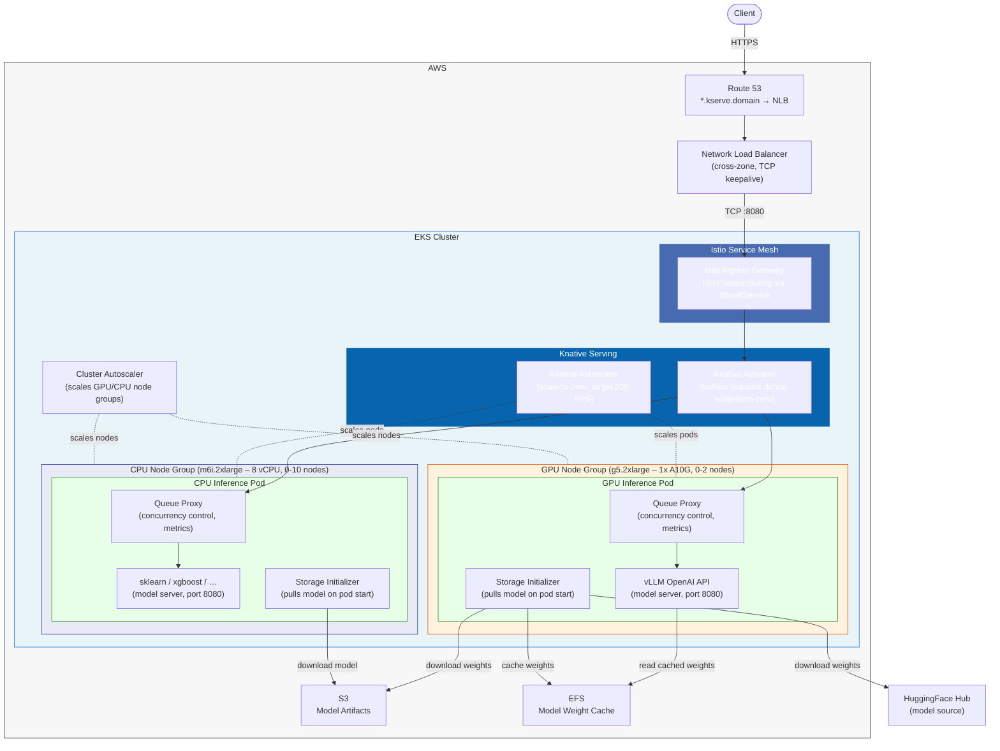

# EKS cluster for Kserve
Installs an EKS cluster with installed Kserve CRDs (custom resource defintion)


## Architecture – Inference Request Path



**Request flow:** Client → Route 53 (wildcard DNS) → NLB → Istio Ingress Gateway → Knative Activator (wakes pods if scaled to zero) → Queue Proxy sidecar → vLLM model server. On cold start, the Storage Initializer pulls model weights from S3 or HuggingFace and caches them on EFS. The Knative Autoscaler manages pod scaling (including scale-to-zero) while the Cluster Autoscaler provisions or removes GPU/CPU nodes as needed.

## Configuration

Copy the example file and fill in your values:

```
cp terraform.tfvars.example terraform.tfvars
```

Set the following variables in `terraform.tfvars`:

- **route53_zone_id** – The ID of your Route 53 hosted zone for the public domain. Find it with `aws route53 list-hosted-zones`. The domain name is derived from the zone automatically.

The file is gitignored, so your secrets stay local.

## Usage

```
cd model_serve_poc/eks-kserve/iac
terraform init
terraform apply
```

Delete cluster
```
terraform destroy
```
