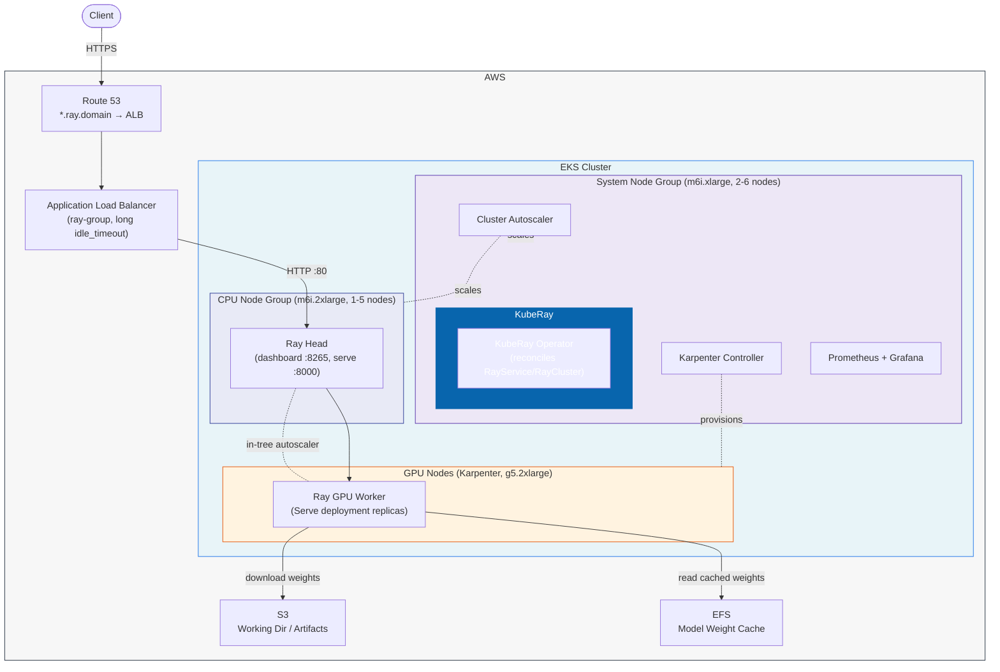

# EKS cluster for Ray Serve

Installs an EKS cluster with KubeRay + Ray Serve and the same production
infrastructure stack as the sister `eks-kserve` cluster.

## Architecture – Inference Request Path



**Request flow:** Client → Route 53 (`*.ray.<domain>`) → ALB (ray-group, long idle timeout for cold starts) → Ray head pod (`dashboard.ray.<domain>` → `:8265`, `serve.ray.<domain>` → `:8000`) → GPU worker (Karpenter-provisioned, Bottlerocket NVIDIA). On cold start, the worker downloads the Ray `working_dir` archive from S3 and caches model weights on EFS. Ray's in-tree autoscaler scales Serve replicas; Cluster Autoscaler manages the system/CPU ASGs; Karpenter provisions/consolidates GPU nodes.

## What's in here

| File | Purpose |
|------|---------|
| `vpc.tf` | 3-AZ private VPC with 9 subnets (system/cpu/gpu slices) + 3 NAT gateways |
| `data.tf` | AZ discovery, ECR token, GPU instance-type offering filter |
| `eks.tf` | EKS cluster (v1.33), managed node groups (system + cpu), CSI + Pod Identity addons |
| `iam.tf` | IRSA roles: EBS/EFS CSI, LB controller, Ray S3, Cluster Autoscaler |
| `autoscaler.tf` | Cluster Autoscaler (managed node groups only — Karpenter handles GPU) |
| `load_balancer.tf` | AWS Load Balancer Controller |
| `karpenter.tf` | Karpenter + GPU `EC2NodeClass` / `NodePool` (Bottlerocket NVIDIA, AZ-restricted) |
| `gpu_operator.tf` | NVIDIA GPU Operator (device plugin + DCGM exporter) |
| `storage.tf` | S3 artifact bucket, EFS cache, gp3 default StorageClass |
| `monitoring.tf` | kube-prometheus-stack + Ray/KubeRay/DCGM scrape configs, Grafana ALB |
| `keda.tf` | KEDA (optional event-driven autoscaling) |
| `namespaces.tf` | `ray-serve` namespace with quotas, limit range, IRSA-bound service account |
| `route53.tf` | `*.ray.<domain>`, `grafana.<domain>`, `mlflow.<domain>` wildcard/alias records |
| `ray_serve.tf` | KubeRay operator, Ray dashboard + serve services, shared ray-group ALB |
| `mlflow.tf` | Optional MLflow tracking server |
| `cleanup.tf` | Destroy-time hook: deletes RayServices, NodeClaims, PVCs, LBs; drains ASGs |
| `vars.tf` / `variables_scaling.tf` | All tunables |

## Configuration

Copy the example file and fill in your values:

```
cp terraform.tfvars.example terraform.tfvars
```

Set the following variables in `terraform.tfvars`:

- **route53_zone_id** – ID of your Route 53 hosted zone for the public domain. Find it with `aws route53 list-hosted-zones`. The domain name is derived from the zone automatically.

## Usage

```
cd model_serve_poc/eks-ray/iac
terraform init
terraform apply
```

Delete cluster:

```
terraform destroy
```
